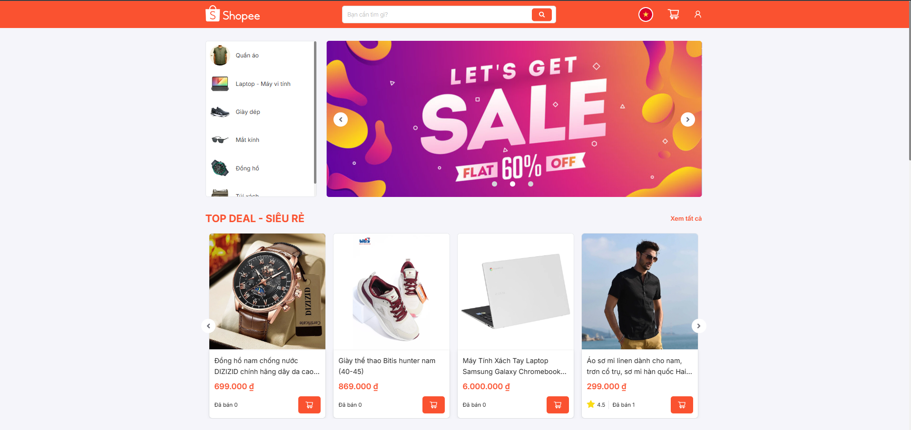
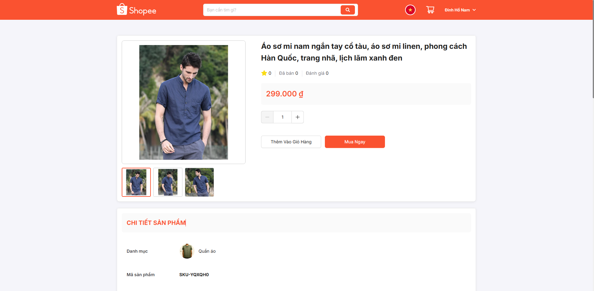
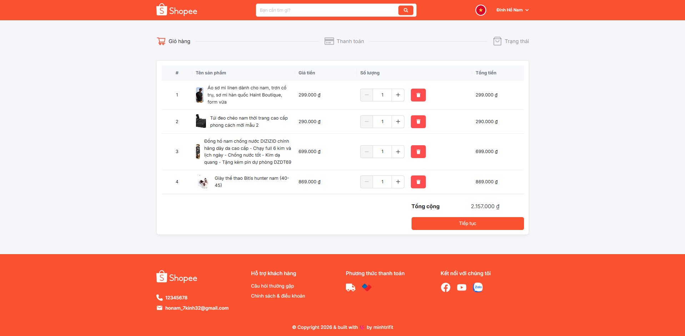
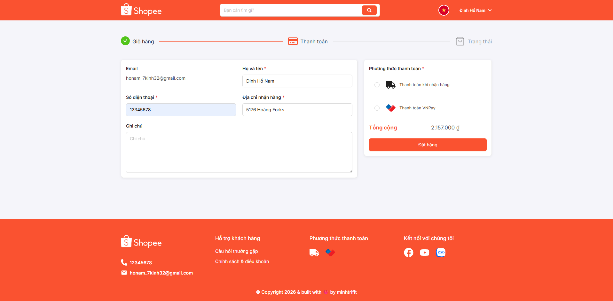
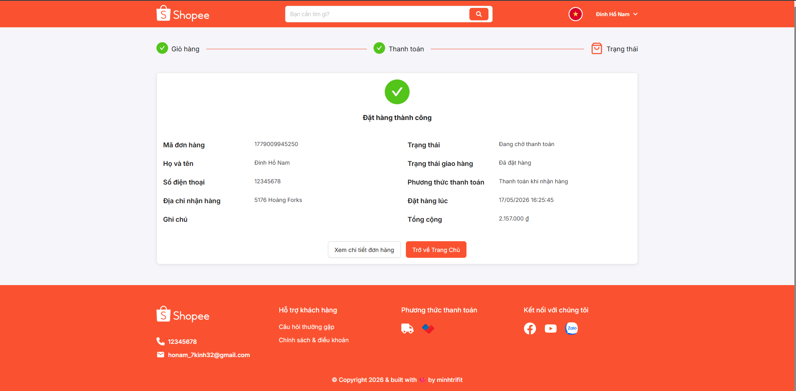
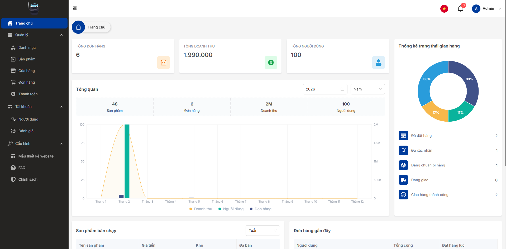
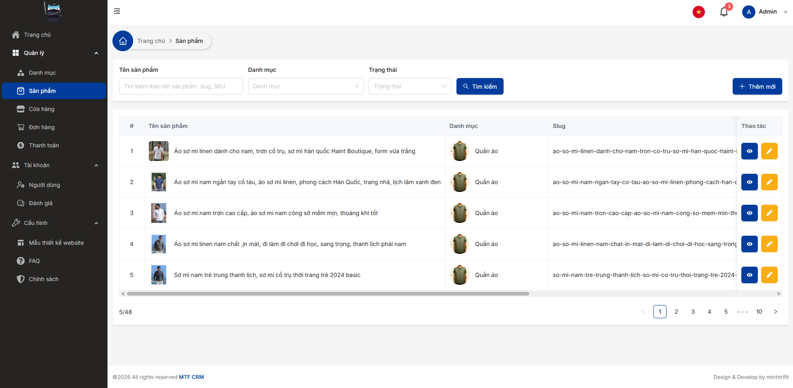
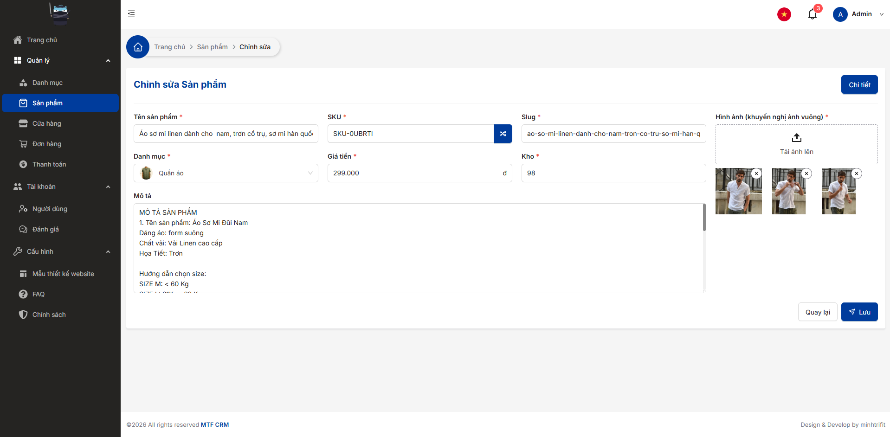

# MTF CRM CLIENT DOCUMENTATION

 

<!--  -->

# 📋 Table of Contents

1. [Technical Stack](#technical-stack)
2. [Project Setup](#project-setup)
   1. [Environment](#environment)
   2. [Source code setup](#source-code-setup)
   3. [Docker](#docker)
3. [Showcase](#showcase)

## 📁 Technical Stack <a name="technical-stack"></a>

<p align="left"> <a href="https://reactjs.org/" target="_blank" rel="noreferrer">  </a> <a href="https://tailwindcss.com/" target="_blank" rel="noreferrer">  </a> <a href="https://www.typescriptlang.org/" target="_blank" rel="noreferrer">  </a> </p>

- [React.js](https://react.dev) - The library for web and native user interfaces
- [AntDesign](https://ant.design) - Help designers/developers building beautiful products more flexible and working with happiness
- [Tailwind CSS](https://tailwindcss.com) - Rapidly build modern websites without ever leaving your HTML
- [TypeScript](https://www.typescriptlang.org) - JavaScript with syntax for types

## 💽 Project Setup <a name="project-setup"></a>

### 🌍 Environment <a name="environment"></a>

```console
node version: >20. (Recommended 24.12.0)
```

### 📦 Source code setup <a name="source-code-setup"></a>

⚙️ Config [.env]() file in dir with path `.env`:

- VITE_ADMIN_CODE: (optional) use for create admin account

```bash
VITE_APP_NAME=MTF CRM
VITE_APP_KEY=mtf_crm_client
VITE_API_URL=http://localhost:5000
VITE_ADMIN_CODE=abc123
```

📥 Installation packages:

Intall packages & dependencies (use --force tag to install conflict packages version, detail in **Conflict npm packages** topic).

```console
npm install --force
```

Or install packages with legacy peer dependencies.

```console
npm install --legacy-peer-deps
```

Run client project (supported by [Vite](https://vite.dev))

```console
npm run dev
```

### 🐳 Docker <a name="docker"></a>

Buid & run app with Docker

```console
docker-compose up -d --build
```

## 📁 Showcase <a name="showcase"></a>

### Homepage



### Product detail



### Cart



### Payment



### Payment result



### Admin dashboard



### Admin product





## 📄 Related Document <a name="api-document"></a>

- [Icon repo](https://www.svgrepo.com)

## 💌 Contact

- Author - [minhtrifit](https://minhtrifit-dev.vercel.app)
- [Github](https://github.com/minhtrifit)

> CopyRight© minhtrifit
